# Plant Spot

## Portfolio Project 5 - Code Institute

Plant Spot is an eCommerce site for people of all ages and backgrounds who want to enhance their home or office space with plants. Indoor plants are currently on trend for their ability to bring a touch of nature inside, helping to purify the air and creating a calm, fresh atmosphere.

This site is fictional and was built for education purposes and no orders will be fulfilled.

[View the live project here](https://plant-spot.herokuapp.com/)


## Table of contents
1. [UX](#ux)
    * [User Stories](#userstories)
    * [Stategy](#strategy)
    * [Scope](#scope)
    * [Structure](#structure)
    * [Skeleton](#skeleton)
    * [Surface](#surface)

2. [Technologies](#technologies)
3. [Features](#features)
4. [Marketing](#marketing)
5. [Testing](#testing)
    * [TESTING.md](https://github.com/Lucy-Glanville-Brown/plant-spot/blob/main/TESTING.md)
6. [Deployment](#deployment)
7. [Credits](#credits)
8. [Acknowledgements](#acknowledgements)


## UX <a name="ux"></a>

### User Stories <a name="userstories"></a>

* As a Shopper I want to be able to View a list of products so that I can Select some to purchase
* As a Shopper I want to be able to View individual product details so that I can Identify the price, description, product rating, product image and available sizes.
* As a Shopper I want to be able to Easily view the total of my purchases at any time so that I can Avoid spending too much
* As a Site User I want to be able to Easily register for an account so that I can Have a personal account and be able to view my profile
* As a Site User I want to be able to Easily login or logout so that I can Access my personal account information
* As a Site User I want to be able to Easily recover my password in case I forget it so that I can Recover access to my account
* As a Site User I want to be able to Receive an email confirmation after registering so that I can Verify that my account registration was successful
* As a Site User I want to be able to Have a personalized user profile so that I can View my personal order history and order confirmations, and save my payment information
* As a Shopper I want to be able to Sort the list of available products so that I can Easily identify the best rated, best priced and categorically sorted products
* As a Shopper I want to be able to Sort a specific category of product so that I can Find the best-priced or best rated products in a specific category, or sort the products in that category name
* As a Shopper I want to be able to Sort multiple categories of products simultaneously so that I can Find the best-priced or best-rated products across broad categories, such as "pet friendly" or "flowering"
* As a Shopper I want to be able to Search for a product by name or description so that I can Find a specific product I'd like to purchase
* As a Shopper I want to be able to Easily see what I've searched for and the number of results so that I can Quickly decide whether the product I want is available
* As a Shopper I want to be able to View items in my bag to be purchased so that I can Identify the total cost of my purchase and all items I will receive
* As a Shopper I want to be able to Adjust the quantity of individual items in my bag so that I can Easily make changes to my purchase before checkout
* As a Shopper I want to be able to Easily enter my payment information so that I can Check out quickly and with no hassles
* As a Shopper I want to be able to Feel my personal and payment information is safe and secure so that I can Confidently provide the needed information to make a purchase
* As a Shopper I want to be able to View an order confirmation after checkout so that I can Verify that I haven't made any mistakes
* As a Shopper I want to be able to Receive en email confirmation after checking out so that I can Keep the confirmation of what I've purchased for my records
* As a Store Owner I want to be able to Add a product so that I can Add new items to my store
* As a Store Owner I want to be able to Edit/Update a product so that I can Change product prices, description, images and other product criteria
* As a Store Owner I want to be able to Delete a product so that I can Delete a product
* As a Shopper I want to be able to Quick add on products page so that I can To save me time so I don't need to go to the products detail page
* As a Shopper I want to be able to Contact the company so that I can I can find the contact information for the store
* As a Shopper I want to be able to Leave a review (Create) so that I can to help other shoppers decide if they want to purchase the product
* As a Shopper I want to be able to Edit your review so that I can in case I have made any mistakes
* As a Shopper I want to be able to Delete your review so that I can if I no longer want my review to be displayed
* As a Site User I want to be able to Sign up for newsletter so that I can so I can be kept up to date with new products, deals and offers
* As a Site User I want to be able to Follow on social media so that I can so I can be kept up to date with new products, deals and offers
* As a Site User I want to be able to Add/Remove items from a wishlist so that I can so I can decide if I would like to purchase the item


I used GitHub Projects to create a Kanban board to manage the planning and implementation of the functionality I wanted to include in this project. Click [here](https://github.com/users/Lucy-Glanville-Brown/projects/5/views/2) to see my project board.

### Strategy <a name="strategy"></a>

* Develop an e-commerce website so that people can browse, choose and purchase Plant Spot's products.
* The site must be visually appealing and simple to navigate.
* Create an Admin access account on the platform to allow the company to make the required changes to the data sets in the database.
* Produce a secure and comprehensive backend structure, including database hosting any data stored online.
* Build a smart and responsive web app to enable users to view displayed information easily.
* Handle any errors in such a way to help the user understand the issue and provide an easy form of contact if any error should persist.


### Scope <a name="scope"></a>

For the users I wanted to provide them with easy naviagation and eye catching images for the homepage and products. The site has responsive design so should function correctly across various devices such as, Mobiles, Tablet, Laptop and Desktop.

**Functional Requirements**   
The unregistered users will be able to:  
- Sign up to the site by providing the username, email, and password.    
- View all products and sort them by price, rating, name and category.  
- Search for products.  
- View the product's detail.  
- Add products to the shopping bag.  
- Update and remove items in the shopping bag.  
- Checkout and make a payment.  
- Receive an email confirmation of the transaction. 

The registered users will be able to:  
- Do all things that unregistered users are able to do.   
- Log in to the site by providing a username and password.  
- View the profile page.  
- Update delivery information on their profile page.  
- View order history on their profile page.  
- Write reviews for products that they have purchased.  
- Edit those reviews.  
- Delete those reviews.  
- Add products to their wishlist.  
- Remove products from the wishlist.

The admin/ site owners will be able to:
- Have all functionalities as a registered user.  
- Add a product to the site.  
- Edit or update a product.  
- Delete a product. 

**Non-functional Requirements**  
Users will be able to:  
- View reviews left by registered users.  
- Send a message to the store via contact form.  
- Navigate easily and intuitively throughout the site.
- Follow Plant Spot on social media.
- Sign up to Plant Spot's newsletter.

### Structure <a name="structure"></a>

This site has been designed with simplicity in mind, each page only has key information on it so that the user can find what they want quickly.

The database allows the following functionality:
* Registration
* Login/Logout
* Leave Product Reviews (Registered Users)
* Add/Edit/Delete products in the store (Superuser Only)
* Contact Form
 
**Database Schema**

The database schema was designed using DrawSQL.


### Skeleton <a name="skeleton"></a>

The wire frames were created using Balsamiq.

Mobile View

Tablet View

Desktop View

### Surface <a name="surface"></a>

#### Images

#### Pexels

The images for Aloe Vera, Peperomia Piccolo, Sansevieria, Zamioculcas, English Ivy, Fiddle Leaf Fig, Calathea, Tradescantia, Croton, Begonia Maculata, Yucca and Asparagus Fern were all found on Pexels

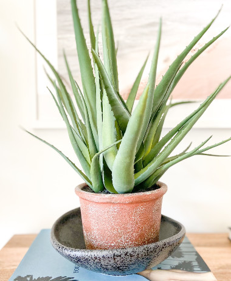

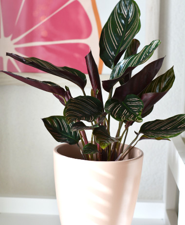

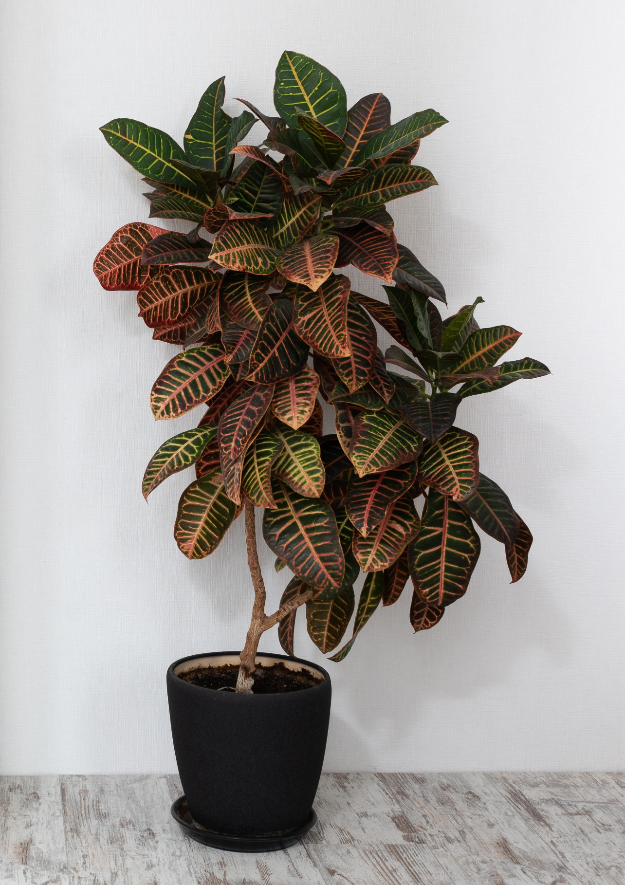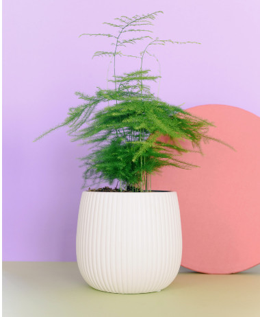

#### Shutterstock

The images for Miranda, Spider Plant, Blue Star Fern, Boston Fern, Chamaedorea, Peperomia Watermelon, Devil's Ivy and Flowering Begonia were all found on Shutterstock.

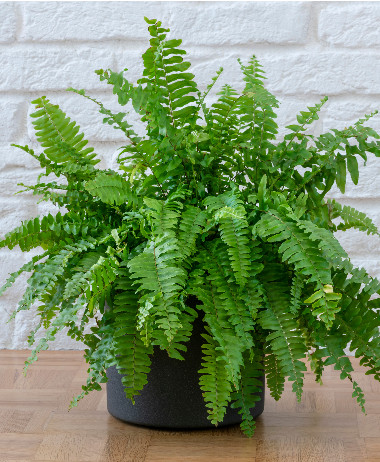


#### Unsplash

The images for Haworthia, Monstera, Ficus Benjamina, Jungle Orchid, Mini Orchid and the background image of the homepage were all found on Unsplash.

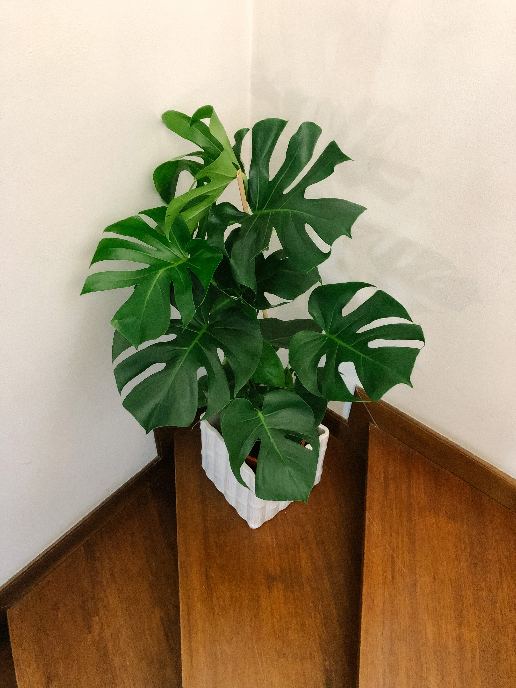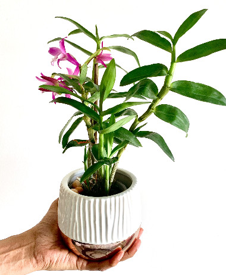

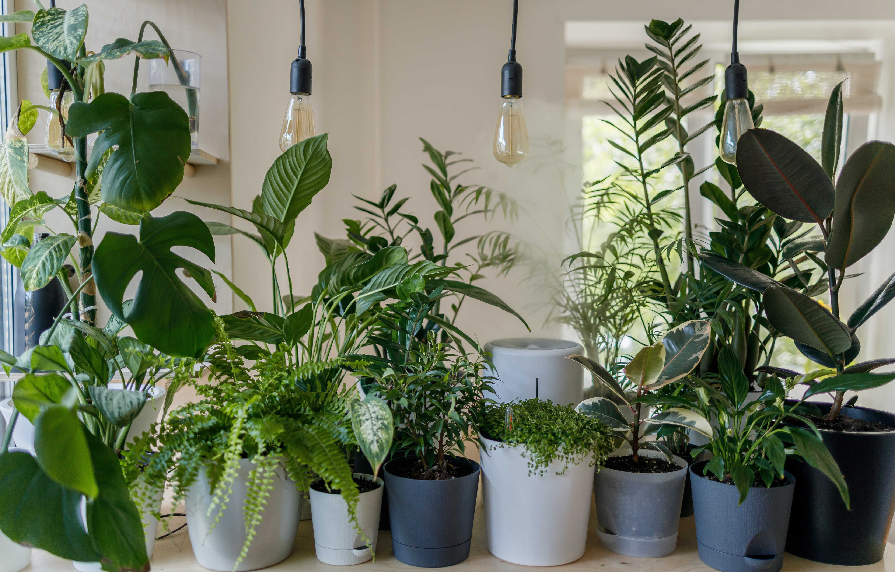

#### Pixabay

The image for Peace Lily was found on Pixabay


#### Colours

[Adobe Color Extract Theme](https://color.adobe.com/create/image)

The colours were chosen by using Adobe Color Extract Theme from the homepage backgorund image I found on Unsplash. 

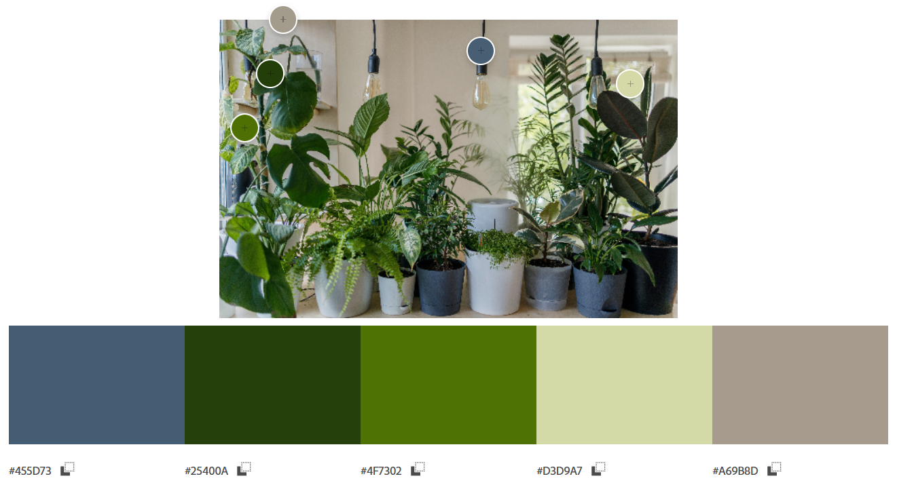

[MyColor.Space](https://mycolor.space/)

Using the colors found on Adobe Color Extract Theme I selected the colour palette below from MyColor.Space

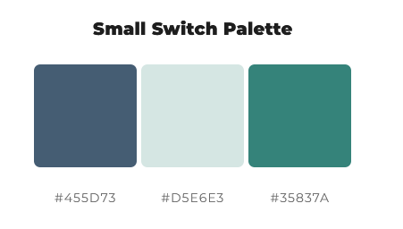

[Contrast Grid - Eightshapes.com](https://contrast-grid.eightshapes.com/?version=1.1.0&background-colors=&foreground-colors=%23FFFFFF%2C%20White%0D%0A%23F2F2F2%0D%0A%23DDDDDD%0D%0A%23CCCCCC%0D%0A%23888888%0D%0A%23404040%2C%20Charcoal%0D%0A%23000000%2C%20Black%0D%0A%232F78C5%2C%20Effective%20on%20Extremes%0D%0A%230F60B6%2C%20Effective%20on%20Lights%0D%0A%23398EEA%2C%20Ineffective%0D%0A&es-color-form__tile-size=compact&es-color-form__show-contrast=aaa&es-color-form__show-contrast=aa&es-color-form__show-contrast=aa18&es-color-form__show-contrast=dnp)

Once the colours were chosen I used a contrast checker to decide which colour I liked best for the Navbar and Footer with white text.

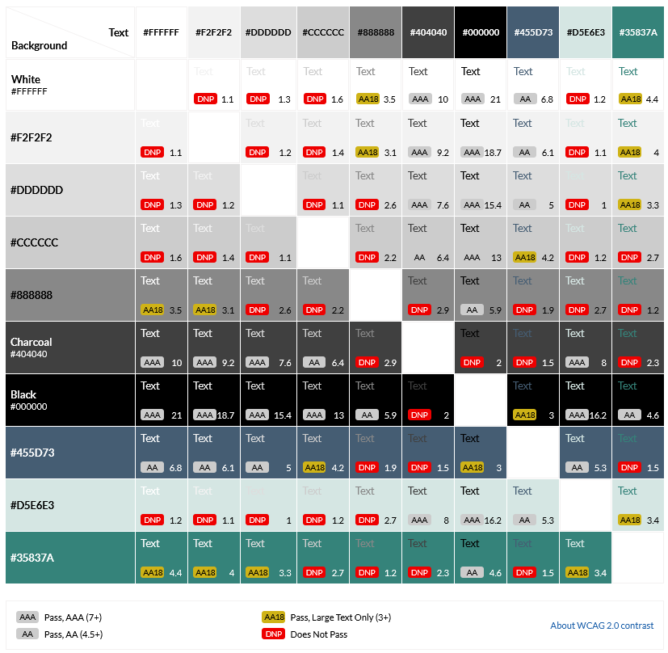


[WebAIM](https://webaim.org/resources/contrastchecker/)

Finally I used the WebAIM contrast checker to find the right shade of green which would pass all accessibility test with white text.

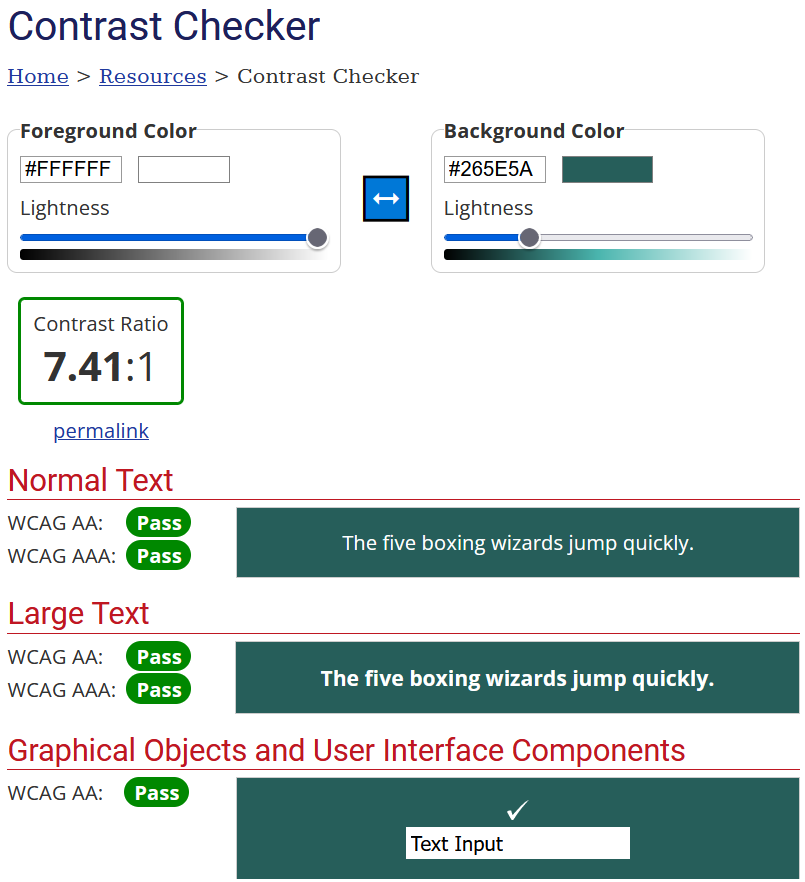


#### Typography

I decided to use ‘Montserrat’ for the Plant Spot branding and ‘Lato’ and sans-serif for the remaining text.

[Back to top ⇧](#)

## Technologies <a name="technologies"></a>

### Languages

1. HTML
2. CSS
3. Javascript
4. Python

### Libraries, Frameworks and Programmes Used 

* Google Fonts
* Font Awesome
* Balsamiq
* GitHub / GitPod
* Heroku
* Django
* Bootstrap
* AWS
* Stripe Payments
* Summernote

## Features <a name="features"></a>

### Existing Features

**Navigation & Header**


* **Logo** - The Plant Spot Logo is linked to the homepage so when clicking on it will take the user back to the homepage
* **Search Bar** -  The search bar is coded to display the results of the user's search request, using the product name and description as parameters
* **User Icon** - There is an icon for the user options. The user icon's dropdown selection is updated depending on whether the user is logged in, logged out, or if they a logged in as a superuser. The options are Register and Login if not signed in, My Profile and Logout is signed in and if the user is a Superuser they will be able to see Product Management.

   **Not Signed in Dropdown**


   **Signed in Dropdown**
   

 
   **Signed in as SuperUser**


* **Wishlist Icon** - There is an icon for the wishlist which will show the current items you have in your wishlist.
* **Shopping Bag Icon** - There is an icon for the shopping bag which will show the current bag total if you have items in your bag.
* **Link to All Products** - On the second row there is a link to All Products where you can select products By Price, By Rating, By Category or view All Products.


* **Link to Plant Type** - On the second row there is also a link to Plant Types where you can select products by their category Succulents & Cacti, Indoor Plants, Air Purifying, Pet Friendly, Trailing, Patterned & Colourful, Flowering or All Plant Types.


* **Link to Contact Us** - There is also a link for Contact Us which will take the user to a contact form to be completed.
* **Free Delivery Banner** - There is a banner telling the user that there's free delivery on ourders over £50.

**Footer**


Each page of the website features a consistent responsive footer design:
* **Social Media Links** - These links connect the site user to the store's business profile on Facebook, and also the developer's LinkedIn and GitHub profiles.
* **Newsletter Sign Up** - There is a MailChimp signup form where the user can sign up to the store's newsletter.

**Homepage**


* Navigation and Header Links
* Hero Image
* Jumbotron with Shop Now button
* Footer 

**Products**


* Navigation and Header Links
* Sort the list of Products by:
    * Price (low to high)
    * Price (high to low)
    * Rating (low to high)
    * Rating (high to low)
    * Name (A - Z)
    * Name (Z - A)
    * Category (A - Z)
    * Category (Z - A)


* Displays a list of Products with:
    * Product Image
    * Product Name
    * Price
    * Category
    * Rating

* Footer
* If user is SuperUser the edit/delete product buttons will be visible


**Products Details**


* Navigation and Header Links
* Displays the Products with:
    * Product Image
    * Product Name
    * Price
    * Category
    * Rating
    * Product Description
* Quantity:
    * Minus button to decrease quantity
    * Quantity input box where the user can type the quantity required
    * Plus button to increase quantity
* Keep Shopping button which returns the user to the all products page
* Add To Bag button which adds the item and desired quantity to the shopping bag
* Add To Wishlist button which adds 1 quantity of the product to the wishlist
* Product Reviews:
    * Site User can view the product reviews
    * Logged in User can leave a product review    
* Footer
* * If user is SuperUser the edit/delete product buttons will be visible


**Reviews**

* No reviews and user not logged in


* Reviews and user not logged in


* Reviews and User signed in displays review form to complete


* Reviews if User is the author of the review the edit/delete buttons will be visible


* Editing review


* Delete review


**Product Management**


**Add Product:**
* Category drop-down menu
* SKU
* Name
* Description
* Price
* Rating
* Image url
* Select Image button
* Cancel button
* Add Product button
* Success message once added product

**Edit Product:**


* Alert message - You are editing Product Name
* Category drop-down menu
* SKU
* Name
* Description
* Price
* Rating
* Image url
* Current Image displayed
* Checkbox to remove Current Image
* Select Image button
* Cancel button
* Update Product button
* Success message once updated product

**Delete Product:**


* Delete button
* Success message once deleted product

**Wishlist**


* Navigation and Header Links
* **No items in the Wishlist:**
    * Displays message that your wishlist is empty
    * Keep Shopping button which returns the user to the all products page


* **Items in the Wishlist:**
    * Product Image
    * Product Name
    * Product SKU
    * Product Price
    * Minus button to decrease quantity
    * Quantity input box where the user can type the quantity required
    * Plus button to increase quantity
    * Update button to update the wishlist quantity for the product
    * Remove button to remove the item from the wishlist
    * Subtotal
    * Wishlist Total
    * Keep Shopping button which returns the user to the all products page    
* Footer

**Shopping Bag**


* Navigation and Header Links
* **No items in the Shopping Bag:**
    * Displays message that your shopping bag is empty
    * Keep Shopping button which returns the user to the all products page


* **Items in the Shopping Bag:**:
    * Product Image
    * Product Name
    * Product SKU
    * Product Price
    * Minus button to decrease quantity
    * Quantity input box where the user can type the quantity required
    * Plus button to increase quantity
    * Update button to update the shopping bag quantity for the product
    * Remove button to remove the item from the shopping bag
    * Subtotal
    * Bag Total
    * Delivery Cost
    * Grand Total
    * Delivery message advising of how much more they need to spend for free delivery
    * Keep Shopping button which returns the user to the all products page
    * Secure Checkout button which takes the user to the checkout page   
* Footer

**Checkout**


* Navigation and Header Links
* Checkout Form:
    * Full Name
    * Email Address
    * Phone Number
    * Street Address 1
    * Street Address 2
    * Town or City
    * County, State or Locality
    * Postal Code
    * Country
    * Card Number
* Order Summary:
    * Product Image
    * Product Name
    * Qty
    * Subtotal
    * Order Total
    * Delivery Cost
    * Grand Total
* Adjust Bag button which takes the user back to the shopping bag page
* Complete Order button which processes the payment and order
* Footer

**Order Confirmation**


**Profile**


* Navigation and Header Links
* Default Delivery Information:
    * Phone Number
    * Street Address 1
    * Street Address 2
    * Town or City
    * County, State or Locality
    * Postal Code
    * Country
    * Update Information button
* Order History:
    * Order Number
    * Date
    * Items
    * Order Total
* Footer
* **Order Confirmation from Profile Page**


**Contact Us**


* Navigation and Header Links
* Contact Us Form:
    * Name
    * Email Address
    * Subject
    * Message
    * Send Message button
* Footer


### Future Features

* Quick Add To Bag option on the All Products page to make adding to the shopping bag easier
* Deals and Offers section
* Option to comment on reviews
* Add wishlist to the user's profile

[Back to top ⇧](#)

## Marketing <a name="marketing"></a>

### Business Model

The business model used for the PlantSpot would be a B2C (Business to Customer), this is due to the business selling products directly to the customer through the platform. The target market for these products are people of all ages and backgrounds who want to enhance their home or office space with indoor plants.

Customers who are buying products from PlantSpot should be able to:

* Easily view and purchase plants from the site.
* Easily navigate and search for products they wish to purchase.
* Be able to subscribe for to a newsletter.

### Search Engine Optimization

**sitemap.xml**

A sitemap was made to list the websites important URL's to ensure that search engines are able to easily navigate through the site and understand its structure. This was made using XML-sitemaps.com using the following steps:

1. Paste the URL of the deployed site into XML-sitemaps.
2. Download the XML sitemap file.
3. Drag and drop this files into the projects root folder, and ensure it is labelled sitemap.xml

**robots.txt***

A robots.txt file was created to tell search engines where not to allowed go on the site and increase the quality of the site, ultimately improving the SEO rating. The following steps were taken to create this:
1. A file was added named robots.txt.
2. The following code was written into this file, adding in your personalised sitemap url:

    ```
    User-agent: *
    Disallow:
    Sitemap: YOUR_SITEMAP_URL
    ```

### Facebook Page


### Email Subscription Service - Mail Chimp

In the footer of the site there is a newsletter sign up form which the users can complete.


[Back to top ⇧](#)

## Testing <a name="testing"></a>

Testing information can be found in a separate testing file [here](https://github.com/Lucy-Glanville-Brown/plant-spot/blob/main/TESTING.md "Link to testing file")

[Back to top ⇧](#)

## Deployment <a name="deployment"></a>

This project was developed using a GitPod workspace. The code was committed to Git and pushed to GitHub using the terminal. The code was then remotely deployed to Heroku.

### Deploying on Heroku

To deploy this page to Heroku from its GitHub repository, the following steps were taken:

1. Create the Heroku App:
    * Select "Create new app" in Heroku.
    * Choose a name for your app and select the location.

2.  Attach the Postgres database:
    * In the Resources tab, under add-ons, type in Postgres and select the Heroku Postgres option.

3.  Prepare the environment and settings.py file:
    * In the Settings tab, click on Reveal Config Vars and copy the URL next to DATABASE_URL.
    * In your GitPod workspace, create an env.py file in the main directory.
    * Add the DATABASE_URL value and your chosen SECRET_KEY value to the env.py file.
    * Add the SECRET_KEY value to the Config Vars in Heroku.
    * Update the settings.py file to import the env file and add the SECRETKEY and DATABASE_URL file paths.
    * Update the Config Vars with the Cloudinary URL, adding into the settings.py file also.
    * In settings.py add the following sections:
    ```
    STATIC_URL
    STATICFILES_DIRS
    MEDIA_URL
    MEDIA_ROOT
    TEMPLATES_DIR
    Update DIRS in TEMPLATES with TEMPLATES_DIR
    Update ALLOWED_HOSTS with ['app_name.herokuapp.com', 'localhost']
    ```

4.  Set DISABLE_COLLECTSTATIC and Deploy to Heroku:
    * Create three directories in the main directory; media, storage and templates.
    * Create a file named "Procfile" in the main directory and add the following:

        ` web: gunicorn project-name.wsgi `
        
    * in the terminal, log in to Heroku and then enter the following:

        ` heroku config:set DISABLE_COLLECTSTATIC=1 --app (Heroku App Name) `

    * Go to the 'Deploy' tab on Heroku and connect to GitHub, then to the required repository. Click on 'Deploy Branch' and wait for the build to load. When the build is complete, the app can be opened through Heroku.

5. Set the config Vars on Heroku:
    * Navigate to the 'Settings' tab and click 'Reveal Config Vars'.
    * Enter key-value pairs that match those in your project files for the keys below:

        |          KEY          |               VALUE               |
        |:---------------------:|:---------------------------------:|
        | SECRET_KEY            | YOUR_SECRET_KEY                   |
        | STRIPE_PUBLIC_KEY     | YOUR_STRIPE_PUBLIC_KEY            |
        | STRIPE_SECRET_KEY     | YOUR_STRIPE_SECRET_KEY            |
        | DATABASE_URL          | YOUR_DATABASE_URL                 |
        | STRIPE_WH_SECRET      | YOUR_STRIPE_WH_SECRET             |
        | AWS_SECRET_ACCESS_KEY | YOUR_AWS_SECRET_ACCESS_KEY        |
        | AWS_ACCESS_KEY_ID     | YOUR_AWS_ACCESS_KEY_ID            |
        | USE_AWS               | YOUR_USE_AWS                      |
        | EMAIL_HOST_PASS       | YOUR_EMAIL_HOST_PASS              |
        | EMAIL_HOST_USER       | YOUR_EMAIL_HOST_USER              |
        | DISABLE_COLLECTSTATIC | 1 (Add this variable temporarily) |


### Forking the Repository

By forking the GitHub Repository we make a copy of the original repository on our GitHub account to view and/or make changes without affecting the original repository by using the following steps:

1. Log into GitHub or create an account.
2. Locate the GitHub Repository.
3. At the top of the repository, on the right side of the page, select "Fork"
4. You should now have a copy of the original repository in your GitHub account.

### Creating a Clone

To clone the website please use the following steps: -

1. Navigate to the repository in github.
2. Choose the correct repository. In this case it is
3. Click the 'Code' button
4. You will now be given options to make a clone of the website, to download it or to open with GitHub Desktop. You can choose to clone the 'HTTPS', the 'SSH' or 'GitHub CLI'
5. Open Git Bash or similar
6. Navigate to your desired directory for the cloned project.
7. Type 'git clone' followed by the URL copied in step 3.

    ` git clone https://github.com/Lucy-Glanville-Brown/plant-spot.git `

8. Press 'Enter' to create your local clone.
9. Create a new env.py file at the base directory level and copy the following into the created env.py file:
```
import os

os.environ["DEVELOPMENT"] = "True"
os.environ["SECRET_KEY"] = "" Add your secret key
os.environ["STRIPE_PUBLIC_KEY"] = "" Add your stripe public key
os.environ["STRIPE_SECRET_KEY"] = "" Add your stripe secret key
os.environ["STRIPE_WH_SECRET"] = "" Add your stripe Webhook secret key
os.environ["EMAIL_HOST_PASS"] = "" Passcode from your email client
os.environ["EMAIL_HOST_USER"] = "" Your email address
```
10. Type the following in the terminal to install all the required django modules and dependencies:

    ` pip3 install -r requirements.txt `

11. Next, create your database by entering the following two commands in the terminal, one after another:

    ` python3 manage.py makemigrations `

    ` python3 manage.py migrate `

12. You will also need to install the data for the json files for categories and products by enterning the two comands below, one after another:

    ` python3 manage.py loaddata categories `

    ` python3 manage.py loaddata products `

13. To be able to have admin access, create a superuser using the line below and then following the instructions in the terminal:

    ` python3 manage.py createsuperuser `

[Back to top ⇧](#)

## Credits <a name="credits"></a>

* **Pexels**
    * bt3gl - Aloe Vera photo [here](https://www.pexels.com/photo/aloe-vera-plant-on-brown-clay-pot-5982611/)
    * Ekaterina Bolovtsova - Mini Peperomia Piccolo photo [here](https://www.pexels.com/photo/green-plant-on-brown-clay-pot-9130870/)
    * Charlotte May - Sansevieria photo [here](https://www.pexels.com/photo/sansevieria-in-pot-near-books-on-chest-of-drawers-5825581/)
    * Lokesh Tiwari - Zamioculcas photo [here](https://www.pexels.com/photo/photo-plant-in-a-pot-8549167/)
    * Kulbir - English Ivy photo [here](https://www.pexels.com/photo/photo-of-an-ivy-plant-in-a-white-pot-7365049/)
    * Lachlan Ross - Fiddle Leaf Fig photo [here](https://www.pexels.com/photo/green-ficus-lyrata-on-table-7084309/)
    * Nina Pintar - Calathea photo [here](https://www.pexels.com/photo/wood-relaxation-summer-pot-6754892/)
    * Rachel Claire - Tradescantia photo [here](https://www.pexels.com/photo/green-potted-plant-on-wooden-shelf-4857756/)
    * Max Vakhtbovych - Croton photo [here](https://www.pexels.com/photo/potted-codiaeum-variegatum-plant-placed-near-wardrobe-in-room-6508343/)
    * Kulbir - Begonia Maculata photo [here](https://www.pexels.com/photo/close-up-shot-of-a-plant-in-white-pot-7493211/)
    * Ata Ebem - Yucca photo [here](https://www.pexels.com/photo/yucca-plant-on-white-pot-11118532/)
    * Ksenia Chernaya - Asparagus Fern photo [here](https://www.pexels.com/photo/green-fern-plant-on-white-pot-7149718/)

* **Shutterstock**
    * waskitokw - Miranda photo [here](https://www.shutterstock.com/image-photo/side-view-succulent-called-echeveria-agavoides-1879018693)
    * TuktaBaby - Spider Plant photo [here](https://www.shutterstock.com/image-photo/spider-plant-chlorophytum-bichetii-karrer-backer-1670765764)
    * Firn - Blue Star Fern photo [here](https://www.shutterstock.com/image-photo/tropical-phlebodium-aureum-blue-star-fern-1529766614)
    * Berna Namoglu - Boston Fern photo [here](https://www.shutterstock.com/image-photo/nephrolepis-exaltata-beautiful-potted-ferns-green-2085224557)
    * nikkimeel - Chamaedorea photo [here](https://www.shutterstock.com/image-photo/green-palm-chamaedorea-bamboo-pot-on-2031904922)
    * Ingrid Liem - Peperomia Watermelon [here](https://www.shutterstock.com/image-photo/peperomia-watermelon-leaves-pot-bright-background-2154225531)
    * Emily frost - Devil’s Ivy photo [here](https://www.shutterstock.com/image-photo/epipremnum-aureum-plant-golden-pothos-on-1757060777)
    * Farhad Ibrahimzade - Flowering Begonia photo [here](https://www.shutterstock.com/image-photo/colorful-elatior-begonia-flower-plant-1381596731)


* **Unsplash** 
    * vadim kaipov - Homepage image [here](https://unsplash.com/photos/8ZELrodSvTc?utm_source=unsplash&utm_medium=referral&utm_content=creditShareLink)  
    * Susan Jang - Haworthia photo [here](https://unsplash.com/photos/TQLSW8tfAU8?utm_source=unsplash&utm_medium=referral&utm_content=creditShareLink)
    * Giorgio Marini - Monstera photo [here](https://unsplash.com/photos/ZUYzwHzUQgM?utm_source=unsplash&utm_medium=referral&utm_content=creditShareLink)
    * feey - Ficus Benjamina photo [here](https://unsplash.com/photos/hPVWVpZoQJw?utm_source=unsplash&utm_medium=referral&utm_content=creditShareLink)
    * Sanni Sahil - Jungle Orchid photo [here](https://unsplash.com/photos/yGt_7EcrLjc?utm_source=unsplash&utm_medium=referral&utm_content=creditShareLink)
    * Pawel Czerwinski - Mini Orchid photo [here](https://unsplash.com/photos/LLBHaRrsA2Y?utm_source=unsplash&utm_medium=referral&utm_content=creditShareLink)

* **Pixabay**
    * mfiol - Peace Lily photo [here](https://pixabay.com/photos/plant-peace-lily-inside-white-1978269/)

* **Code Institute** for the creating the gitpod-full-template and the Boutique Ado walkthrough project which this was based on

* **The Little Botanical** was the main site I used for research and based my categories, products and prices on what they had on their site. I also wrote basic product descriptions from their plant information. [here](https://thelittlebotanical.com/ "Link to The Little Botanical site")

* **Bunny The Compiler** Let’s build a movie review django app [here](https://blog.devgenius.io/lets-build-a-movie-review-django-app-47658f8e3751 "Link to Bunny the Compiler's Blog Page")

* **Very Academy** Python Django Ecommerce Customer Wish List youtube video was helpfully when creating the wishlist [here](https://www.youtube.com/watch?v=OgA0TTKAtqQ "Link to Very Academy's youtube video")

* **Python Package Index (PyPI)** django-review 1.10.0 documentation [here](https://pypi.org/project/django-review/ "Link to PyPI django-review 1.10.0 documentation")

* **XML Sitemaps** used from creating the sitemap.xml [here](https://www.xml-sitemaps.com/ "Link to XML Sitemaps")

* **Tables Generator** used to create markdown tables for the readme file [here](https://www.tablesgenerator.com/markdown_tables "Link to markdown table generator")

* **DrawSQL** used to create the database schema [here](https://drawsql.app/diagrams)

[Back to top ⇧](#)

## Acknowledgements <a name="acknowledgements"></a>

* Tutors and students of Code Institute and the Code Institute Slack Community for their helpfulness and assistance when needed.
* Daisy McGirr my Code Institute mentor, thank you for all your help and support.


[Back to top ⇧](#)
